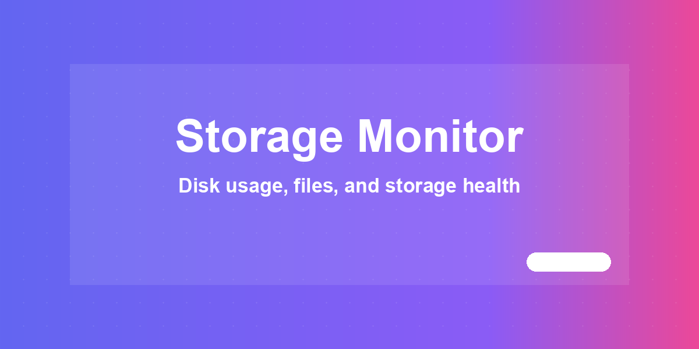
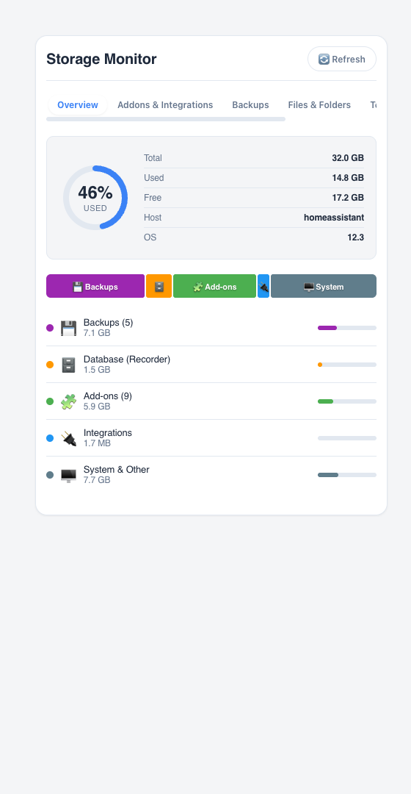
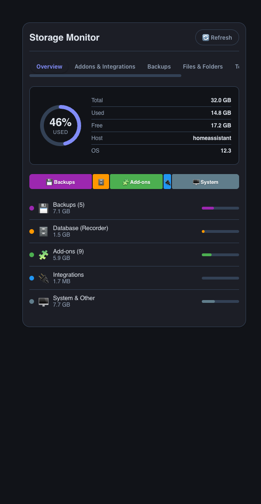

# Storage Monitor



Break down Home Assistant disk usage — backups, recorder database, add-ons,
integrations and system files — from a Lovelace card. Zero configuration:
add the card and it reads your Supervisor's storage info directly.

[](https://github.com/MacSiem/ha-storage-monitor/releases) [](LICENSE)

## How it works

**Short version: it works automatically, if your installation has the
Supervisor.** The card needs no configuration:

1. **Disk gauge from Supervisor.** On load it calls the Supervisor API
   (`supervisor/api` → `/host/info`, `/os/info`) for total / used / free disk
   space, hostname and OS version, and renders a usage ring plus a
   category treemap (Backups, Database, Add-ons, Integrations, System &
   Other).
2. **Real sizes where the API provides them.** Backups get their actual size
   from `supervisor/api` → `/backups`. Add-ons get their actual size from
   `supervisor/api` → `/addons` plus a per-addon `/addons/{slug}/info` call
   (first 30 installed add-ons). Where a real size isn't available, the card
   shows a small fallback value rather than guessing large numbers.
3. **Estimates where it isn't.** The recorder database size is not exposed by
   the `recorder/info` WebSocket call in current Home Assistant, so its slice
   is estimated from the remaining disk usage; the same is true for the
   config/`www`/`.storage`/`media`/`share` folder sizes on the Files &
   Folders tab, which are proxies built from what's already known rather than
   a real filesystem walk. Integrations are counted via `config_entries/list`
   and given a flat per-integration storage estimate. Every estimated view is
   labelled as such in the card.

### What is automatic vs. manual

| Automatic | Manual (optional) |
|---|---|
| Disk gauge + category breakdown on load | Nothing required to start |
| Real backup and add-on sizes from Supervisor | Switching between the 6 tabs |
| Refresh every 2 minutes while the card is visible | Manual refresh (⟳ button) |
| Cleanup suggestions (old backups, large DB, stopped add-ons) | Acting on cleanup suggestions yourself |

## Screenshots

| Light | Dark |
|---|---|
|  |  |

*The Overview tab: disk gauge, category treemap and per-category breakdown.
Dark mode follows your Home Assistant theme automatically. Five more tabs —
Add-ons & Integrations, Backups, Files & Folders, Top Consumers and Cleanup —
are available from the tab bar.*

## Installation

1. Open HACS → Custom repositories.
2. Add `https://github.com/MacSiem/ha-storage-monitor` as category
   **Dashboard** (Lovelace plugin).
3. Install **Storage Monitor** and reload your browser.

## Quick start

```yaml
type: custom:ha-storage-monitor
```

That's it — no options are required.

### Optional sidebar panel (`configuration.yaml`)

```yaml
panel_custom:
  - name: ha-storage-monitor
    sidebar_title: Storage Monitor
    sidebar_icon: mdi:harddisk
    url_path: ha-storage-monitor
    js_url: /local/community/ha-storage-monitor/ha-storage-monitor.js
    embed_iframe: false
    config: {}
```

After restart, **Storage Monitor** appears in the HA sidebar.

## Features

- **Overview** — disk usage ring, category treemap and per-category size list
  (Backups, Database, Add-ons, Integrations, System & Other).
- **Add-ons & Integrations** — every installed add-on with size/status/version,
  and every config entry split into Core vs. HACS with an estimated storage
  total.
- **Backups** — each backup with real size, date and type from Supervisor.
- **Files & Folders** — an estimated breakdown of `/config`, `/config/www`,
  `/config/custom_components`, `/config/.storage`, `/backup`, `/addons`,
  `/ssl`, `/media`, `/share`, sortable by size or name.
- **Top Consumers** — the 10 largest items ranked across backups, add-ons
  (real sizes only) and the recorder database.
- **Cleanup** — automatic suggestions when disk usage is high, backups pile
  up, the recorder DB grows large, or stopped add-ons still hold storage.

## FAQ

**Do I have to configure anything?**
No. Add the card and it reads your Supervisor's storage info by itself.

**Why does it say "Requires Home Assistant OS / Supervised"?**
The card needs the Supervisor API (`supervisor/api`) for disk, add-on and
backup data. This is only available on Home Assistant OS or Home Assistant
Supervised installations — Home Assistant Container/Core setups don't expose
it, and the card shows this notice instead of the tabs.

**Are the sizes exact?**
Backup and add-on sizes come straight from the Supervisor API and are exact
when the API provides them (add-ons fall back to a small placeholder value
if Supervisor doesn't report a size). The recorder database size and the
Files & Folders breakdown are estimates derived from total disk usage, not a
real filesystem scan — the card labels these views as estimated.

**Does this send data anywhere?**
No. Everything runs locally in your browser against your own Home Assistant
instance — no telemetry, no analytics, no CDN-hosted assets. The only
outbound links are the optional Buy Me a Coffee / PayPal buttons and GitHub
install links, which only open if you click them.

## Changelog

See [CHANGELOG.md](CHANGELOG.md).

## Support

If this tool makes your Home Assistant life easier, consider supporting
development:

- [☕ Buy Me a Coffee](https://buymeacoffee.com/macsiem)
- [💳 PayPal](https://www.paypal.com/donate/?hosted_button_id=Y967H4PLRBN8W)

## License

MIT, see [LICENSE](LICENSE).
