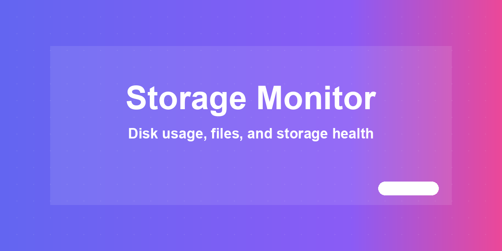
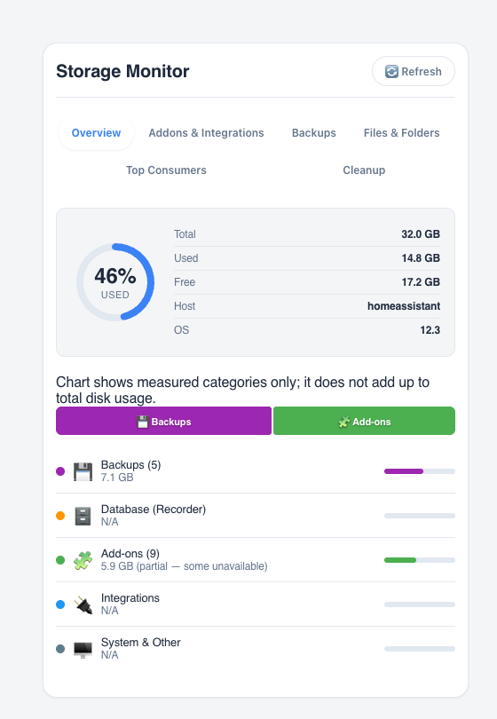
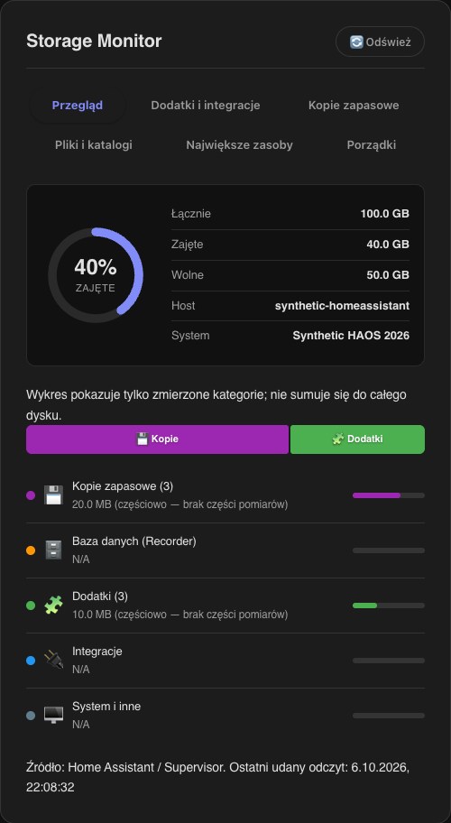

# Storage Monitor



Inspect Home Assistant host disk usage and the storage sizes the Supervisor
actually exposes — backups and, on some installations, add-ons. Zero
configuration: add the card and it reads Supervisor data directly.

[](https://github.com/MacSiem/ha-storage-monitor/releases) [](LICENSE)

## How it works

**It reads automatically when you are an administrator and the installation
has the Supervisor.** The card needs no configuration:

1. **Disk gauge from Supervisor.** On load it calls the Supervisor API
   (`supervisor/api` → `/host/info`, `/os/info`) for total / used / free disk
   space, hostname and OS version. The usage ring is host-wide. The
   category chart includes measured sizes only and does not claim to
   account for all used disk space.
2. **Real sizes where the API provides them.** Backups get their actual size
   from `size_bytes` in `supervisor/api` → `/backups`. Add-ons get their actual size from
   `supervisor/api` → `/addons` plus a per-addon `/addons/{slug}/info` call
   (first 30 installed add-ons). Where a real size isn't available, the card
   shows `N/A` rather than inventing a value.
3. **Clear unavailable and estimated values.** The recorder database size is
   not exposed by the `recorder/info` WebSocket call in current Home
   Assistant, so the card shows `N/A` instead of inventing a value. The
   config/`www`/`.storage`/`media`/`share` values on the Files & Folders tab
   are `N/A`; this browser card cannot measure directory sizes, including
   `/backup` and `/addons`. Backup inventory can include remote locations.
   Integrations are counted via `config_entries/get`, without assigning
   imaginary byte sizes. Partial add-on and backup totals are labelled.

### What is automatic vs. manual

| Automatic | Manual (optional) |
|---|---|
| Disk gauge + category breakdown on load | Nothing required to start |
| Real backup and add-on sizes from Supervisor | Switching between the 6 tabs |
| Refresh after 2 minutes on the next HA update | Manual refresh (⟳ button) |
| Measured capacity and review prompts | Reviewing backup retention or stopped add-ons in HA |

## Screenshots

| Light | Dark |
|---|---|
|  |  |

*The Overview tab with synthetic disk metrics: gauge and measured category
breakdown. Unknown categories remain N/A instead of being treated as zero.
Dark mode follows your Home Assistant theme. Five more tabs —
Add-ons & Integrations, Backups, Files & Folders, Top Consumers and Cleanup —
are available from the tab bar.*

## Installation

1. Open HACS and search for **Storage Monitor** (category **Dashboard**).
2. Download the card and reload your browser.
3. Add a card of type `custom:ha-storage-monitor`. In YAML mode, register
   `/hacsfiles/ha-storage-monitor/ha-storage-monitor.js` as a module resource.
   Keep exactly one Storage Monitor resource; remove an older manual duplicate.

## Quick start

```yaml
type: custom:ha-storage-monitor
```

That's it — no options are required.

### Optional sidebar panel (`configuration.yaml`)

```yaml
panel_custom:
  - name: ha-storage-monitor
    sidebar_title: Storage Monitor
    sidebar_icon: mdi:harddisk
    url_path: ha-storage-monitor
    js_url: /local/community/ha-storage-monitor/ha-storage-monitor.js
    embed_iframe: false
    config: {}
```

After restart, **Storage Monitor** appears in the HA sidebar.

## Features

- **Overview** — host disk usage ring, measured category chart and per-category
  size/`N/A` list (Backups, Database, Add-ons, Integrations, System & Other).
- **Add-ons & Integrations** — every installed add-on with available measured
  size/status/version, and config entries with their setup source and status. Setup source
  does not identify Core versus HACS provenance; storage remains N/A.
- **Backups** — each backup with measured `size_bytes` when available, date
  and type from Supervisor.
- **Files & Folders** — known paths with `N/A` because this card does not
  measure directories: `/config`, `/config/www`,
  `/config/custom_components`, `/config/.storage`, `/backup`, `/addons`,
  `/ssl`, `/media`, `/share`, sortable by size or name.
- **Top Consumers** — the 10 largest items ranked across backups, add-ons
  (real sizes only) and the recorder database.
- **Cleanup** — measured capacity warning and prompts to review backup
  retention or stopped add-ons; no deletion is performed.

## FAQ

**Do I have to configure anything?**
No. Add the card and sign in as an administrator on HA OS / Supervised; it reads available Supervisor storage information automatically.

**Why does it say "Requires Home Assistant OS / Supervised"?**
The card needs the Supervisor API (`supervisor/api`) for disk, add-on and
backup data. This is only available on Home Assistant OS or Home Assistant
Supervised installations — Home Assistant Container/Core setups don't expose
it, and the card shows this notice instead of the tabs.

**Are the sizes exact?**
Backup and add-on sizes come from the Supervisor API when it provides an
unambiguous measurement. Missing values show `N/A`, and incomplete totals
are labelled partial. The recorder
database size is shown as `N/A` because Home Assistant's current
`recorder/info` response does not expose it. The Files & Folders tab is a
path inventory, not a filesystem scan; host disk usage cannot be allocated
to these categories reliably from the available API data.

**Does this send data anywhere?**
No. Everything runs locally in your browser against your own Home Assistant
instance — no telemetry, no analytics, no CDN-hosted assets. The only
outbound links are the optional Buy Me a Coffee / PayPal buttons and GitHub
install links, which only open if you click them.

## Changelog

See [CHANGELOG.md](CHANGELOG.md).

## Support

If this tool makes your Home Assistant life easier, consider supporting
development:

- [☕ Buy Me a Coffee](https://buymeacoffee.com/macsiem)
- [💳 PayPal](https://www.paypal.com/donate/?hosted_button_id=Y967H4PLRBN8W)

The optional in-card support link is shown only to administrators. Dismiss it in the card or set `show_support: false` in the card configuration.

## License

MIT, see [LICENSE](LICENSE).

## Privacy and data

The card reads available Home Assistant and Supervisor storage information. Host details, integration lists and backup metadata can identify your installation. Keep diagnostics private and redact host names, paths and identifiers before sharing.

See [SECURITY.md](SECURITY.md) for safe vulnerability reporting and [NOTICE](NOTICE) for licensing notices.
